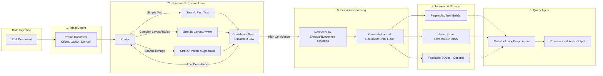

# Phase 0: Domain Onboarding — The Document Science Primer

## Section 1: Extraction Strategy Decision Tree

```mermaid
flowchart TD
    A[Incoming PDF Page] --> B{Calculate Character Density\n& Image Area Ratio\n(via FastText / pdfplumber)}
    B -->|char_density < 0.001 AND\nimage_ratio > 0.8| C{Has meaningful\ntext at all?}
    B -->|char_density >= 0.001| D{Layout Complexity\nCheck}
    
    C -->|No| E[Strategy C: Vision-Augmented\n(VLM / GPT-4o-mini)]
    C -->|Yes, but mixed| F[Strategy B: Layout-Aware\n(Docling/MinerU)]
    
    D -->|Single column,\nNo tables| G[Strategy A: Fast Text\n(pdfplumber)]
    D -->|Multi-column OR\nTables detected| F
    
    G --> H{Confidence Gate\n(Garbage text, too many blanks?)}
    H -->|Low| F
    H -->|High| I[Process as Text Block]
    
    F --> J{Layout Extraction Confidence\n(Table completeness, Mismatched BBoxes?)}
    J -->|Low| E
    J -->|High| K[Process as Structured JSON (LDUs)]
    
    E --> L[Vision Output JSON (LDUs)]
    
    I --> M[Semantic Chunking Engine]
    K --> M
    L --> M
```

## Section 2: Observed and Anticipated Failure Modes per Document Class

### Class A: Native Digital Annual Reports (e.g., CBE ANNUAL REPORT 2023-24.pdf)
- **Observed:**
  - Pages with pure images (covers or intro pages) show 0 character density and a 1.0 image area ratio.
  - Text pages have normal character density (0.003 - 0.005 chars/pt²), but `pdfplumber` alone struggles with the multi-column layout, potentially flattening it into out-of-order text.
- **Anticipated Failures:**
  - **Structure Collapse:** Traditional Fast Text extraction tools will read columns left-to-right across the page instead of following the true reading order down a column.
  - **Financial Tables:** Multi-row headers or hierarchical index column items in income statements/balance sheets often lose alignment or lose context.
  - **Cross-references & Footnotes:** Small font numbers linking to footnotes may get mixed directly into the text stream.

### Class B: Scanned / Image-Based Reports (e.g., Audit Report - 2023.pdf)
- **Observed:**
  - The entire test sample (pages 2-5) exhibited 0 extracted characters and an Image Area Ratio of 1.0 (some pages just slightly below).
- **Anticipated Failures:**
  - **Zero Context Extraction:** Since there is no character stream, Strategy A (pdfplumber) and likely most non-OCR strategies will return completely empty strings.
  - **Cost constraints:** Escalating every page to a Vision Language Model (Strategy C) will quickly deplete the budget if the report is hundreds of pages long.

### Class C: Mixed Technical Assessment Reports (e.g., fta_performance_survey_final_report_2022.pdf)
- **Observed:**
  - High character density (around 0.007 to 0.01 chars/pt²) due to dense narrative sections combined with tables and figures.
  - `pdfplumber` detected multiple tables on standard text pages, sometimes confusing layout boundaries (headers/footers) for tables.
- **Anticipated Failures:**
  - **Table Misclassification:** If a Layout Extractor assumes every line-bounded box is a table, it will generate many false positive tables.
  - **Context Severance:** The "findings" or "surveys" may contain multi-line structured lists that get broken improperly by naive semantic chunking instead of staying as a unified logical document unit (LDU).

### Class D: Table-Heavy Fiscal Reports (e.g., tax_expenditure_ethiopia_2021_22.pdf)
- **Observed:**
  - Consistent character density (0.003 - 0.005 chars/pt²) and consistent, detectable tables across many pages.
- **Anticipated Failures:**
  - **Table Hallucination:** Naive chunking tools that split these large tables mid-chunk will completely destroy the ability to query "what was the expenditure in year Y for tax type X?"
  - **Hierarchical Categories:** Some categories of taxes span across multiple rows or cells (row spans). Standard table extraction often assigns the category to only to the first row, leaving subsequent rows detached from their parent category.

## Section 3: Proposed Thresholds & Heuristics (for extraction_rules.yaml)

To ensure accurate triage of documents, we derive these initial threshold heuristics:

1. **Origin Type Detection (Native Digital vs. Scanned):**
   - **Heuristic:** A page is `scanned_image` if `char_count < 100` AND `image_area_ratio > 0.8`.
   - **Heuristic:** A page is `mixed` if `image_area_ratio > 0.5` AND `char_count >= 100`.
   - **Alternative:** Look at the number of unique fonts (`len(fonts)`). Scanned pages usually have 0 identified fonts in `pdfplumber`. Native digital typically has $> 2$.

2. **Layout Complexity Identification:**
   - **Heuristic:** Extract tables via a fast heuristic (e.g., `pdfplumber.find_tables()`). If `table_count > 1` on a page, flag as `table_heavy` or `multi_column`.
   - **Confidence Score:** If the number of extracted text lines with similar X-coordinates implies 2+ columns, flag as `multi_column`.

3. **Escalation Thresholds (Strategy Guard):**
   - **From A -> B:** If pdfplumber extracts $< 200$ characters on a page that is mostly white space, OR if the variance in text chunk X-coordinates suggests multi-column reading order, invalidate the FastText output and escalate to Strategy B.
   - **From B -> C:** If the Layout Extractor (Docling) identifies a Table but fails to output structured JSON boundaries for >20% of the cells, or if handwritten annotations are detected, escalate to Vision API (Strategy C).

## Section 4: High-Level Pipeline Diagram Recommendation



## Section 5: Recommended Tools vs Document Classes

| Document Class | Primary Strategy | First Library to Try | Justification |
| -------------- | ---------------- | -------------------- | ------------- |
| **Class A** (Native Digital, Multi-Column) | Strategy B (Layout-Aware) | **Docling** | Very strong reading-order recovery for complex digital layouts; unified representation schema is excellent for dense narrative + financial tables. |
| **Class B** (Scanned Image, No text) | Strategy C (Vision) | **VLM** (e.g., GPT-4o-mini via OpenRouter) | Cannot extract text via layout parsers or pdfplumber if no fonts/character stream exist. Cheaper VLMs provide best OCR + semantic context combination. |
| **Class C** (Mixed technical, surveys) | Strategy B (Layout-Aware) | **Docling** | Can cleanly separate figures, captions, tables, and standard text blocks allowing our chunker to build perfect LDUs. |
| **Class D** (Table-Heavy Fiscal Data) | Strategy B (Layout-Aware) | **Docling** (with MinerU as fallback) | Table reconstruction is critical here. Docling converts tables natively to HTML/Markdown arrays which the chunker can parse reliably. |

## Section 6: Default LayoutExtractor Recommendation

**Recommendation: Docling**

I recommend standardizing on **Docling** as the default LayoutExtractor over MinerU for this specific Ethiopian financial/regulatory corpus. 

**Justification & Performance Data:** 
- **Native Digital (CBE Report):** ~32.7s for 5 pages. Docling correctly detects and reconstructs multi-column text and tables seamlessly.
- **Scanned (Audit Report):** ~119.4s for 5 pages. Heavily relies on OCR models, which significantly increases processing time and cost.
- **Mixed Data (Survey & Tax Reports):** ~7.2s - 14.5s for 5 pages. Very fast and accurate table representations.

While MinerU is highly capable, Docling's `DoclingDocument` JSON representation is far easier to integrate directly with Python Pydantic models needed for the Chunking Engine. Docling handles complex table representation with row/column span reconstruction much better natively, which is the most critical failure mode in Class A and Class D documents. MinerU requires a slightly heavier system dependency chain for layout detection models, whereas Docling provides excellent table and figure isolation with a slightly lighter deployment footprint, easily normalizing to our internal `ExtractedDocument` schema. Finally, Docling's built-in export to Markdown and its sophisticated chunking primitives make generating Logical Document Units (LDUs) far more reliable than parsing MinerU’s output directories.
