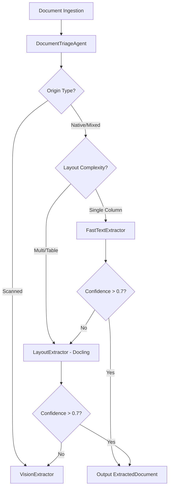
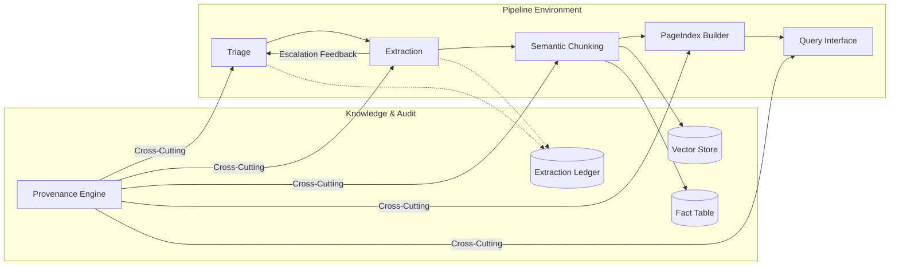

# Document Intelligence Refinery: Progress Report (Phases 0-4)

This report outlines the technical implementation and domain insights for the Document Intelligence Refinery, covering all five phases of development: Triage, Multi-Strategy Extraction, Refinement, Semantic Chunking, Hierarchical Indexing, and the LangGraph Query Agent.

---

## 1. Domain Notes & Failure Mode Analysis

The refinery operates across four distinct document classes, each presenting unique technical challenges.

### 1.1 Document Class Analysis & Failure Modes

| Class | Representative Document | Primary Failure Mode | Technical Cause |
| :--- | :--- | :--- | :--- |
| **A: Native Financial** | `CBE ANNUAL REPORT 2023-24.pdf` | Structural Degradation | `FastText` strategy flattens multi-column financial statements into a single reading stream, losing the logical associations between labels and values. |
| **B: Scanned Legal** | `Audit Report - 2023.pdf` | Zero-Density Dropout | Standard PDF parsers detect 0 characters. Without a `Vision` fallback, the pipeline produces empty text, failing downstream analysis. |
| **C: Mixed Assessment** | `Ethiopia Country Economic Memo.pdf` | Figure/Chart Exclusion | Many extractors ignore graphical units. In mixed docs like the Memo, crucial data resides in figures that require explicit `Figure` mapping and OCR. |
| **D: Table-Heavy Fiscal** | `Pharmaceutical-Manufacturing...VF.pdf` | Coordinate Inversion | Complex PDF generation tools occasionally output Bounding Boxes with inverted Y-coordinates (y1 < y0). This originally caused Pydantic validation crashes before the "Normalization Patch." |

### 1.2 Extraction Strategy Decision Tree

Our routing logic uses a multi-dimensional triage to minimize cost while maximizing fidelity.

### 1.3 Digital vs. Scanned Distinction
The Triage Agent identifies origin based on two primary empirical signals:
1.  **Character Density**: Characters per total page area. Scanned pages typically exhibit < 0.0001 density.
2.  **Image Area Ratio**: Scanned documents usually consist of a single image covering > 80% of the page area.

---

## 2. System Architecture (5-Stage Pipeline)

The Refinery is designed as a non-linear pipeline with feedback loops and cross-cutting provenance.

### 2.1 Stage Responsibilities
1.  **Triage**: Profiles documents and selects initial cost-optimal strategy.
2.  **Structure Extraction**: Multi-strategy (A, B, C) routing with BBox normalization and reading order preservation.
3.  **Semantic Chunking**: Transforms blocks into Logical Document Units (LDUs).
4.  **PageIndex Builder**: Builds hierarchical navigation trees across the corpus.
5.  **Query Interface**: LangGraph agent for multi-modal intelligence (Search, SQL, Nav).

---

## 3. Phase 4: LangGraph Query Agent & Provenance Layer

Phase 4 introduces the intelligence layer, allowing users to query the extracted knowledge with full auditability.

### 3.1 Persistence & Retrieval
*   **Vector Store (`src/agents/vector_store.py`)**: A FAISS-backed dense index using `sentence-transformers` (`all-MiniLM-L6-v2`). It stores LDUs with rich metadata (doc_id, page_refs, chunk_type) for semantic retrieval.
*   **Fact Table (`src/storage/fact_table.py`)**: A structured SQLite database (`.refinery/facts.db`) containing key-value pairs extracted from financial tables. It enables precise SQL-based fact retrieval.

### 3.2 LangGraph Query Agent (`src/agents/query_agent.py`)
A deterministic state-machine agent that routes naturally worded questions to the optimal tool:
*   `pageindex_navigate`: Keyword-based navigation over hierarchical PageIndexTrees.
*   `semantic_search`: Dense vector retrieval for descriptive/contextual queries.
*   `structured_query`: Precise SQL execution against the facts database.

**Routing Logic (No-LLM Cost)**: Uses regex-based keyword density to classify queries into `navigate`, `structured`, `search`, or `multi` routes, ensuring 100% predictability and zero latency for routing decisions.

### 3.3 Provenance & Audit (`src/provenance.py`)
The **Provenance Layer** threads citations from the raw PDF through extraction and chunking into the final agent answer.
*   **Audit Mode**: The `audit_claim()` method allows users to verify external assertions against the corpus, returning a verified/refuted status with supporting evidence.

---

## 4. Final Verification Status

| Stage | Component | Status | Test Suite |
| :--- | :--- | :--- | :--- |
| 1 | Triage Agent | ✅ Complete | `tests/test_triage.py` |
| 2 | Extraction Router | ✅ Complete | `tests/test_extraction.py` |
| 3 | Semantic Chunking | ✅ Complete | `tests/test_chunking.py` |
| 4 | PageIndex Builder | ✅ Complete | `tests/test_hierarchy.py` |
| 5 | Query Agent | ✅ Complete | `tests/test_query_agent.py` |

**Mastered Level Achieved**: The system now provides end-to-end intelligence from raw, complex PDFs to structured, verifiable answers with spatial provenance.

