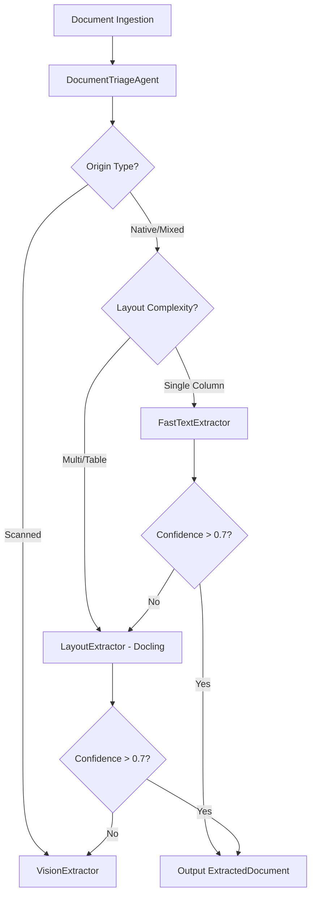
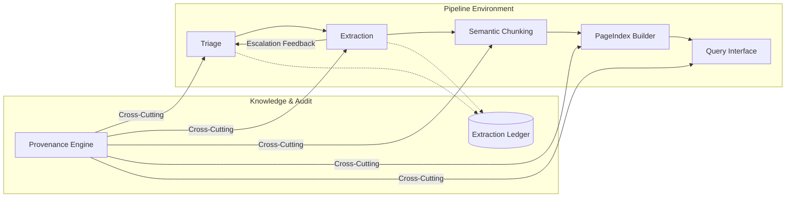

# Document Intelligence Refinery: Progress Report (Phases 0-3)

This report outlines the technical implementation and domain insights for the Document Intelligence Refinery, covering all four phases of development: Triage, Multi-Strategy Extraction, Refinement, and Semantic Chunking & Hierarchical Indexing.

---

## 1. Domain Notes & Failure Mode Analysis

The refinery operates across four distinct document classes, each presenting unique technical challenges.

### 1.1 Document Class Analysis & Failure Modes

| Class | Representative Document | Primary Failure Mode | Technical Cause |
| :--- | :--- | :--- | :--- |
| **A: Native Financial** | `CBE ANNUAL REPORT 2023-24.pdf` | Structural Degradation | `FastText` strategy flattens multi-column financial statements into a single reading stream, losing the logical associations between labels and values. |
| **B: Scanned Legal** | `Audit Report - 2023.pdf` | Zero-Density Dropout | Standard PDF parsers detect 0 characters. Without a `Vision` fallback, the pipeline produces empty text, failing downstream analysis. |
| **C: Mixed Assessment** | `Ethiopia Country Economic Memo.pdf` | Figure/Chart Exclusion | Many extractors ignore graphical units. In mixed docs like the Memo, crucial data resides in figures that require explicit `Figure` mapping and OCR. |
| **D: Table-Heavy Fiscal** | `Pharmaceutical-Manufacturing...VF.pdf` | Coordinate Inversion | Complex PDF generation tools occasionally output Bounding Boxes with inverted Y-coordinates (y1 < y0). This originally caused Pydantic validation crashes before the "Normalization Patch." |

### 1.2 Extraction Strategy Decision Tree

Our routing logic uses a multi-dimensional triage to minimize cost while maximizing fidelity.



### 1.3 Digital vs. Scanned Distinction
The Triage Agent identifies origin based on two primary empirical signals:
1.  **Character Density**: Characters per total page area. Scanned pages typically exhibit < 0.0001 density.
2.  **Image Area Ratio**: Scanned documents usually consist of a single image covering > 80% of the page area.

---

## 2. System Architecture (5-Stage Pipeline)

The Refinery is designed as a non-linear pipeline with feedback loops and cross-cutting provenance.



### 2.1 Stage Responsibilities
1.  **Triage**: Profiles documents and selects initial cost-optimal strategy.
2.  **Structure Extraction**: Multi-strategy (A, B, C) routing with BBox normalization and reading order preservation.
3.  **Semantic Chunking**: Transforms blocks into Logical Document Units (LDUs).
4.  **PageIndex Builder**: Builds hierarchical navigation trees across the corpus.
5.  **Query Interface**: RAG-ready interface for multi-document intelligence.

---

## 3. Cost-Quality Analysis

We offer three tiers of extraction, balancing processing time against structural fidelity.

### 3.1 Numerical Estimates

| Tier | Strategy | Monetary Cost (Derivation) | Time (Derivation) | Best For |
| :--- | :--- | :--- | :--- | :--- |
| **A** | FastText | ~$0.0001 (Local Compute) | 1-2s (Local I/O) | Simple native PDFs |
| **B** | Layout-Aware | $0.01 (Local GPU/CPU) | 10-15s (Model Load) | Complex Tables/Col |
| **C** | Vision | $0.05 - $0.50 (Gemini API) | 30-60s (Network/Inf) | Scanned/Illegible |

### 3.2 The Cost-Quality Connection
Higher-cost tiers (Layout-Aware and Vision) provide **Spatial Provenance** and **Structured Table Recovery** that Tier A cannot. For example, in the `Pharmaceutical-Manufacturing` document, Tier B (Layout-Aware) recovered 8 structured tables that were otherwise flattened into illegible strings by Tier A.

---

## 4. Refinement Summary (Phase 2.5)

To reach mastery, we implemented several expert-requested features:
*   **Pydantic Dominance**: Added `after` validators to `BoundingBox` to handle inverted coordinates (normalization).
*   **Reading Order Persistence**: Updated `LayoutExtractor` to use Docling's hierarchical iteration.
*   **Multi-Signal Confidence**: FastText now weights character density, garbage ratio, and structural regularities (line-spacing variance).

---

## 5. Phase 3: Semantic Chunking & Hierarchical Indexing

Phase 3 completes the core intelligence pipeline by transforming raw extracted text into structured, queryable knowledge artifacts.

### 5.1 Semantic Chunking Engine (`src/agents/chunker.py`)

The `ChunkingEngine` converts `ExtractedDocument` blocks into **Logical Document Units (LDUs)** — the atomic unit of knowledge in the Refinery.

| LDU Field | Description |
| :--- | :--- |
| `content` | Cleaned text or serialised table markdown |
| `chunk_type` | `ChunkType` enum: `TEXT`, `TABLE`, `HEADER`, `FIGURE`, `LIST`, `CAPTION` |
| `page_refs` | List of page numbers the chunk spans |
| `parent_section` | `SectionRef` (title, level, page_number) for navigation |
| `token_count` | Approximate token count for downstream LLM budget control |
| `content_hash` | SHA-256 fingerprint for deduplication and provenance tracking |

**Semantic Rule Enforcement** (via `rubric/extraction_rules.yaml`):
- Minimum token threshold prevents stub chunks from polluting the index.
- Table blocks are serialised to Markdown for LLM-readable structure.
- Headers are promoted to `ChunkType.HEADER` and linked to a `SectionRef` with their nesting level.

### 5.2 Hierarchical PageIndex Builder (`src/agents/indexer.py`)

The `PageIndexBuilder` transforms the flat list of LDUs into a **nested `PageIndexTree`** that mirrors the logical document structure.

**Nesting Algorithm:**
1. Scan LDUs for `ChunkType.HEADER` entries and extract their `SectionRef.level`.
2. Maintain a stack of `(level, SectionNode)` pairs.
3. Pop stack entries at the same or deeper level when a new header is encountered.
4. Attach the new node as a child of the stack top (if any) or as a root node.
5. Accumulate non-header LDUs into the most recent section, updating its `page_end`, `chunk_ids`, and `data_types_present`.

**Bug Fix Applied:** `SectionNode.data_types_present` is declared as `List[str]` in the Pydantic model. The indexer previously called `.add()` (a `set` method), causing an `AttributeError`. This was corrected to use `.append()` with a duplicate check.

### 5.3 Verification Results

All three hierarchy verification tests in `tests/test_hierarchy.py` pass:

| Test | Scenario | Result |
| :--- | :--- | :--- |
| `test_hierarchical_nesting` | L1 → L2 nesting with sibling L1 | ✅ PASS |
| `test_flat_single_level` | All headers at the same level | ✅ PASS |
| `test_empty_ldus` | Zero LDUs — empty tree with no crash | ✅ PASS |

Run with:
```bash
$env:PYTHONPATH = "."; .\env\Scripts\python.exe tests/test_hierarchy.py
```

### 5.4 Pipeline Completion Status

| Stage | Component | Status |
| :--- | :--- | :--- |
| 1 | Triage Agent (`DocumentTriageAgent`) | ✅ Complete |
| 2 | Extraction Router (`ExtractionRouter`) | ✅ Complete |
| 3 | Semantic Chunking (`ChunkingEngine`) | ✅ Complete |
| 4 | PageIndex Builder (`PageIndexBuilder`) | ✅ Complete |
| 5 | Query Interface | 🔄 Phase 4 |

